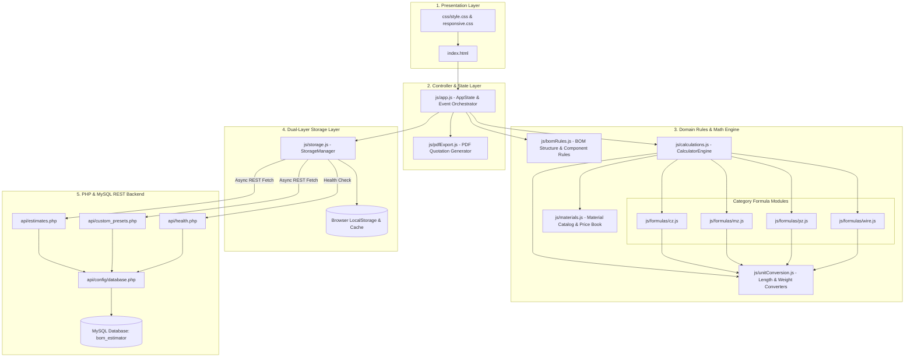
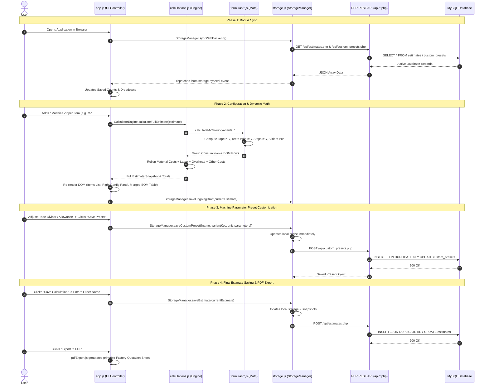

# Zipper BOM Calculator: Comprehensive Workflow & Architecture Walkthrough

## 1. Executive Summary & High-Level Architecture

The **Zipper BOM Calculator** is an enterprise-grade manufacturing Bill of Materials (BOM) and cost estimation application designed for garment zipper factories. It models the physical materials consumption, engineering allowances, dynamic loss curves, labor, and factory overhead required to produce four primary zipper categories:
1. **CZ (Coil Zipper / Nylon)**: Sizes #3 and #5.
2. **MZ (Metal Zipper / Brass, Aluminum, Antique Brass)**: Sizes #3 and #5.
3. **PZ (Plastic / Delrin / Vislon Injection Zipper)**: Sizes #3, #5, and #8.
4. **WIRE (Brass Teeth Wire & Raw Wire Processing)**: Sizes #3, #5 Normal Teeth, and #5 Long Teeth.

The application follows a **modular, layered architecture** that separates UI presentation, reactive state management, domain manufacturing rules, pure mathematical formulas, dual-layer persistence, and a Docker-ready PHP/MySQL backend.



---

## 2. End-to-End System Workflow

The complete lifecycle of a user interaction proceeds through seven distinct phases:



---

## 3. Comprehensive File-by-File Breakdown

### Root Directory Files

#### [index.html](file:///d:/Projects/BOM%20estiamtor/index.html)
- **Role**: The Single Page Application (SPA) entry point and visual shell.
- **Contents**:
  - Top Navigation Bar: Application branding, Saved Calculations modal trigger with live badge counter, Ongoing Estimate quick-restore button, Save Calculation modal trigger, and PDF Export button.
  - Left Sidebar Panel: Multi-item list builder with **+ Add New Item**, item status tags, quantity totals, and deletion triggers.
  - Right Configuration Panel: Active item parameter editor (zipper size, length, unit toggle, quantity, color, style name, remarks, and dynamic loss overrides).
  - Custom Static Parameter Toolbar: Dropdown for selecting saved machine calibration presets (`Standard Parameters` vs user presets) and the **Save Preset** modal trigger.
  - Consolidated / Merged BOM Table: Collapsible table displaying the factory-standardized, merged bill of materials aggregated across all configured items.
  - Labor & Overhead Configuration Card: Method toggle (`per_zipper` vs `hourly`), worker counts, hours, labor rates, and overhead basis (`material_and_labor` vs `material_only`).
  - Cost Summary Dashboard: High-contrast summary metrics cards displaying total order pieces, base material cost, total scrap cost, total labor, factory overhead, total quotation cost, and cost per single zipper.
  - Modals: Saved calculations browser, save estimation dialog, save custom preset modal, and formula transparency inspector.
- **Dependencies**: Loads CSS stylesheets from `css/` and all JavaScript modules from `js/`.

#### [server.js](file:///d:/Projects/BOM%20estiamtor/server.js)
- **Role**: Lightweight Node.js local HTTP static server.
- **Relevance**: Provides an instant development HTTP server running on port 3000 (`http://localhost:3000`) for environments without PHP or Apache installed.
- **Dependencies**: Native Node.js `http`, `fs`, `path`.

#### [CALCULATION FORMULA(1).xlsx](file:///d:/Projects/BOM%20estiamtor/CALCULATION%20FORMULA(1).xlsx)
- **Role**: The engineering master reference spreadsheet from the zipper manufacturing plant.
- **Relevance**: Represents the baseline ground truth for all mathematical divisors, allowance charts, scrap percentage thresholds, teeth wire weight factors, and resin injection weights replicated inside [js/formulas/](file:///d:/Projects/BOM%20estiamtor/js/formulas/).

---

### Stylesheet Files (`css/`)

#### [css/style.css](file:///d:/Projects/BOM%20estiamtor/css/style.css)
- **Role**: Master styling architecture and design system.
- **Features**: Curated Indigo/Slate/Teal modern theme, responsive Flexbox and CSS Grid layouts, glassmorphism cards, custom badges, toggle switches, diff comparison tables, modal dialog backdrops, and button hover micro-interactions.

#### [css/responsive.css](file:///d:/Projects/BOM%20estiamtor/css/responsive.css)
- **Role**: Responsive breakpoints and mobile/tablet adaptations.
- **Features**: Adjusts sidebar and configuration panels to stack vertically on viewports `< 1024px`, formats wide BOM data tables with horizontal scroll containers, and handles print media stylesheets for PDF generation.

---

### Core JavaScript Modules (`js/`)

#### [js/unitConversion.js](file:///d:/Projects/BOM%20estiamtor/js/unitConversion.js)
- **Role**: Pure mathematical unit conversion engine.
- **Exports**: `UnitConversion` global object and Node.js module export.
- **Capabilities**:
  - Length: `inchToCm`, `cmToInch`, `inchToMm`, `mmToInch`, `inchToYard`, `yardToInch`, `meterToInch`, `inchToMeter`.
  - Weight: `kgToLbs`, `lbsToKg`, `kgToGrams`, `gramsToKg`.
  - Normalization: Auto-converts any variant's length and allowances into standard baseline units (inches or cm) before formulas execute.
- **Interconnections**: Imported by [js/calculations.js](file:///d:/Projects/BOM%20estiamtor/js/calculations.js) and all formula modules in [js/formulas/](file:///d:/Projects/BOM%20estiamtor/js/formulas/).

#### [js/materials.js](file:///d:/Projects/BOM%20estiamtor/js/materials.js)
- **Role**: Master raw material catalog and price registry.
- **Exports**: `MaterialsManager` global object and Node.js module export.
- **Capabilities**:
  - Defines master materials catalog: Polyester Tape, Monofilament Coil, Brass Teeth Wire, Stop Wire, POM Resin, Sliders (Auto-lock, Non-lock, Pin-lock), Top Stops, Bottom Stops, Pin & Box sets, Sewing Threads, Reinforcement Film.
  - Assigns default unit prices (USD / BDT / standard currency) per unit of measure (`KG`, `PCS`, `DZN`, `METERS`).
  - Supports runtime price overrides saved with individual calculations.
- **Interconnections**: Queried by [js/calculations.js](file:///d:/Projects/BOM%20estiamtor/js/calculations.js) to price each component in the generated BOM.

#### [js/bomRules.js](file:///d:/Projects/BOM%20estiamtor/js/bomRules.js)
- **Role**: Engineering BOM structural rules engine.
- **Exports**: `BOMRules` global object and Node.js module export.
- **Capabilities**:
  - `generateSuggestedBOM(variant, category)`: Determines which physical parts must exist for a given zipper type:
    - *Closed-End*: Tape + Teeth/Coil + Slider + Top Stop (2 pcs) + Bottom Stop (1 pc).
    - *Open-End*: Tape + Teeth/Coil + Slider + Top Stop (2 pcs) + Pin & Box Set (1 set) + Reinforcement Film.
    - *Two-Way Open-End*: Dual sliders + Left/Right Pin & Box components.
  - `getSuggestedAllowance(category, size, unit, zipperType)`: Supplies the factory-standard production chain allowance (extra tape length required for cutting and machine gripping).
- **Interconnections**: Invoked by [js/app.js](file:///d:/Projects/BOM%20estiamtor/js/app.js) on item creation and by [js/calculations.js](file:///d:/Projects/BOM%20estiamtor/js/calculations.js) during fallback BOM generation.

#### [js/calculations.js](file:///d:/Projects/BOM%20estiamtor/js/calculations.js)
- **Role**: Central calculation engine orchestrator (`CalculatorEngine`).
- **Capabilities**:
  - `calculateFullEstimate(estimate)`: Orchestrates multi-item calculations. Groups similar items, executes formula modules, computes line item consumption, attaches material pricing, calculates dynamic scrap, and rolls up total order metrics.
  - `getStandardStaticParameters(variantKey, unit)`: Retrieves factory baseline static divisors and factors for any zipper configuration.
  - `isStaticParametersModified(variantKey, unit, currentParams)`: Compares active item static parameters against baseline to detect dirty states and activate the "Save Preset" button.
  - Dynamic Slider & Pin/Box loss percentage curves based on total order quantity:
    - $\le 500 \text{ pcs} \rightarrow 8.0\%$
    - $\le 2,000 \text{ pcs} \rightarrow 4.0\%$
    - $\le 5,000 \text{ pcs} \rightarrow 2.5\%$
    - $> 5,000 \text{ pcs} \rightarrow 1.5\%$
- **Interconnections**: Coordinates between [js/formulas/cz.js](file:///d:/Projects/BOM%20estiamtor/js/formulas/cz.js), [js/formulas/mz.js](file:///d:/Projects/BOM%20estiamtor/js/formulas/mz.js), [js/formulas/pz.js](file:///d:/Projects/BOM%20estiamtor/js/formulas/pz.js), [js/formulas/wire.js](file:///d:/Projects/BOM%20estiamtor/js/formulas/wire.js), [js/materials.js](file:///d:/Projects/BOM%20estiamtor/js/materials.js), and [js/app.js](file:///d:/Projects/BOM%20estiamtor/js/app.js).

#### [js/storage.js](file:///d:/Projects/BOM%20estiamtor/js/storage.js)
- **Role**: Data access and persistence adapter (`StorageManager`).
- **Architecture**: **Hybrid Synchronous-Cache + Asynchronous MySQL Synchronization**.
- **Capabilities**:
  - `getAllSavedEstimates()` & `getEstimateById(id)`: Instant retrieval from memory and `localStorage` cache.
  - `saveEstimate(estimate)`: Normalizes state, generates collision-proof unique ID (`calc_TIMESTAMP_RAND`), saves to local cache, and dispatches background `POST /api/estimates.php` to MySQL.
  - `deleteEstimate(id)`: Deletes locally and dispatches `DELETE /api/estimates.php?id=...`.
  - `getCustomPresets(variantKey, unit)`: Returns custom machine formulas scoped by variant and unit.
  - `saveCustomPreset(options)`: Persists preset locally and dispatches `POST /api/custom_presets.php`.
  - `deleteCustomPreset(presetId)`: Deletes preset locally and dispatches `DELETE /api/custom_presets.php?id=...`.
  - `saveOngoingDraft(estimate)` & `getOngoingDraft()`: Auto-saves active in-progress work to `localStorage` so refreshing never loses uncommitted work.
  - `syncWithBackend()`: Performs boot-time reconciliation with MySQL database.
  - `checkBackendHealth()`: Queries `/api/health.php` to report connection diagnostics.
- **Interconnections**: Invoked across [js/app.js](file:///d:/Projects/BOM%20estiamtor/js/app.js) and connects over HTTP to `api/`.

#### [js/pdfExport.js](file:///d:/Projects/BOM%20estiamtor/js/pdfExport.js)
- **Role**: Factory Quotation & BOM PDF generation engine (`PDFExporter`).
- **Capabilities**: Formats the active calculation snapshot, customer reference, date, multi-item table, merged BOM requirements, labor, and costs into a printable or downloadable PDF report.
- **Interconnections**: Triggered by user interaction in [js/app.js](file:///d:/Projects/BOM%20estiamtor/js/app.js).

#### [js/app.js](file:///d:/Projects/BOM%20estiamtor/js/app.js)
- **Role**: Master Application Controller and reactive event hub.
- **Size**: ~6,500 lines of fully structured, modular vanilla JavaScript.
- **Key Responsibilities**:
  - `appState`: Central state tree holding `currentEstimate`, `activeItemId`, `bomViewMode`, `isViewingSavedRecord`.
  - `initApp()`: Bootstraps state, binds DOM events, performs initial calculations, triggers backend sync.
  - `rebuildAndRenderAll()`: Full reactive cycle that updates left item cards, right item editor, BOM tables, cost metric cards, and dirty checks.
  - Preset Management: Handles custom parameter preset dropdown selection, diff modal rendering, and preset application to identical variant items.
  - Ongoing Draft Protection: Seamlessly preserves active drafting work when a user opens historical saved records and provides 1-click restoration.
- **Interconnections**: Orchestrates all DOM elements in [index.html](file:///d:/Projects/BOM%20estiamtor/index.html) and delegates domain logic to [js/calculations.js](file:///d:/Projects/BOM%20estiamtor/js/calculations.js) and persistence to [js/storage.js](file:///d:/Projects/BOM%20estiamtor/js/storage.js).

---

### Formula Modules (`js/formulas/`)

#### [js/formulas/cz.js](file:///d:/Projects/BOM%20estiamtor/js/formulas/cz.js)
- **Category**: Coil Zipper (Nylon Zipper #3 & #5).
- **Core Formulas**:
  $$\text{Required Chain Length} = (\text{Length} + \text{Allowance}) \times \text{Quantity}$$
  $$\text{Polyester Tape (KG)} = \frac{\text{Required Chain Length}}{\text{Tape Divisor}} \times (1 + \text{Loss}\%)$$
  - Standard Tape Divisors: `CZ#5` = 54.5, `CZ#3` = 97.0.
  - Monofilament Coil Weight: Uses factory divisor ($900$ for CZ#5) to calculate continuous polyester filament consumption.
  - Sewing & Core Threads: Factory divisor ($7700$ and $8600$) for top and bobbin threads.
  - U-Top Stop: Calculated either as bulk KG factor or exact 1-per-zipper special order ($+2.5\%$ loss).
  - Sliders & Pin/Box: Dynamic quantity-based loss percentage scale.

#### [js/formulas/mz.js](file:///d:/Projects/BOM%20estiamtor/js/formulas/mz.js)
- **Category**: Metal Zipper (Brass, Antique Brass, Aluminum #3 & #5).
- **Core Formulas**:
  $$\text{Teeth Wire (KG)} = \frac{(\text{Length} + \text{Allowance}) \times \text{Quantity}}{\text{Teeth Wire Divisor}} \times \text{Loss Factor}$$
  - Standard Divisors: `MZ#3` = 32.0 (Loss factor 1.04), `MZ#5` = 17.5 (Loss factor 1.04).
  - Stop Wire (KG): Yields wire consumption for pinching U-top and bottom stops.
  - H-Bottom Stops: Supports factory standard divisor ($1,980$ for #3, $1,350$ for #5) or dynamic factory loss percentage override.

#### [js/formulas/pz.js](file:///d:/Projects/BOM%20estiamtor/js/formulas/pz.js)
- **Category**: Plastic / Delrin / Vislon Zipper (#3, #5, #8).
- **Core Formulas**:
  $$\text{POM Plastic Resin (KG)} = \frac{(\text{Length} + \text{Allowance}) \times \text{Tape Factor}}{\text{Resin Divisor}} \times (1 + \text{Loss}\%)$$
  - Models Polyoxymethylene (POM) pellet injection consumption for teeth molding along with molten top stop and bottom stop molding.

#### [js/formulas/wire.js](file:///d:/Projects/BOM%20estiamtor/js/formulas/wire.js)
- **Category**: Raw Wire / Teeth Wire manufacturing.
- **Core Formulas**: Dedicated draw-down algorithms for raw brass wire processing for #3, #5 normal teeth, and #5 long teeth zipper manufacturing.

---

### Backend API (`api/`) & Database (`database/`)

#### [database/schema.sql](file:///d:/Projects/BOM%20estiamtor/database/schema.sql)
- **Role**: Database initialization script for MySQL.
- **Tables**:
  - `estimates`: Stores normalized estimate JSON trees with extracted indexed columns (`id`, `name`, `reference`, `item_count`, `total_quantity`, `total_estimated_cost`, `cost_per_zipper`, `updated_at`).
  - `custom_presets`: Stores static parameter overrides with composite index on `(variant_key, unit)`.

#### [api/config/database.php](file:///d:/Projects/BOM%20estiamtor/api/config/database.php)
- **Role**: PDO database connection pool.
- **Features**: Docker-ready environment variable extraction (`DB_HOST`, `DB_PORT`, `DB_NAME`, `DB_USER`, `DB_PASS`). Includes intelligent local development port auto-detection (attempts port 3306 first; falls back seamlessly to port 3307 for custom XAMPP configurations).

#### [api/helpers/response.php](file:///d:/Projects/BOM%20estiamtor/api/helpers/response.php)
- **Role**: Standardized API response dispatcher.
- **Features**: Cross-Origin Resource Sharing (CORS) header handling, JSON body decoding, HTTP status codes, and CLI/web environment safety.

#### [api/estimates.php](file:///d:/Projects/BOM%20estiamtor/api/estimates.php)
- **Role**: RESTful controller for estimations.
- **Endpoints**:
  - `GET /api/estimates.php`: Returns array of saved estimates.
  - `GET /api/estimates.php?id={id}`: Returns single detailed estimate.
  - `POST /api/estimates.php`: Inserts or updates an estimate.
  - `POST /api/estimates.php?action=duplicate&id={id}`: Clones estimate.
  - `DELETE /api/estimates.php?id={id}`: Deletes estimate.

#### [api/custom_presets.php](file:///d:/Projects/BOM%20estiamtor/api/custom_presets.php)
- **Role**: RESTful controller for machine calibration presets.
- **Endpoints**:
  - `GET /api/custom_presets.php`: Lists all presets.
  - `GET /api/custom_presets.php?variantKey=mz_3&unit=inch`: Retrieves scoped presets.
  - `POST /api/custom_presets.php`: Inserts or updates preset.
  - `DELETE /api/custom_presets.php?id={id}`: Deletes preset.

#### [api/health.php](file:///d:/Projects/BOM%20estiamtor/api/health.php)
- **Role**: Health check and connectivity diagnostics.
- **Outputs**: Confirms database connection, table availability, record counts, and PHP version.

---

## 4. Interconnection Matrix

| Source File | Directly Calls / Depends On | Purpose of Interconnection |
| :--- | :--- | :--- |
| [index.html](file:///d:/Projects/BOM%20estiamtor/index.html) | `css/*`, `js/*` | Loads application scripts and styles into the browser DOM |
| [js/app.js](file:///d:/Projects/BOM%20estiamtor/js/app.js) | [calculations.js](file:///d:/Projects/BOM%20estiamtor/js/calculations.js) | Dispatches calculation requests on every keystroke or item change |
| [js/app.js](file:///d:/Projects/BOM%20estiamtor/js/app.js) | [storage.js](file:///d:/Projects/BOM%20estiamtor/js/storage.js) | Reads and persists saved estimates, drafts, and presets |
| [js/app.js](file:///d:/Projects/BOM%20estiamtor/js/app.js) | [bomRules.js](file:///d:/Projects/BOM%20estiamtor/js/bomRules.js) | Gets suggested BOM component lists and standard allowances |
| [js/app.js](file:///d:/Projects/BOM%20estiamtor/js/app.js) | [pdfExport.js](file:///d:/Projects/BOM%20estiamtor/js/pdfExport.js) | Triggers quotation PDF export from current estimate state |
| [js/calculations.js](file:///d:/Projects/BOM%20estiamtor/js/calculations.js) | [formulas/cz.js](file:///d:/Projects/BOM%20estiamtor/js/formulas/cz.js) | Executes Nylon Coil BOM math |
| [js/calculations.js](file:///d:/Projects/BOM%20estiamtor/js/calculations.js) | [formulas/mz.js](file:///d:/Projects/BOM%20estiamtor/js/formulas/mz.js) | Executes Metal Zipper BOM math |
| [js/calculations.js](file:///d:/Projects/BOM%20estiamtor/js/calculations.js) | [formulas/pz.js](file:///d:/Projects/BOM%20estiamtor/js/formulas/pz.js) | Executes Plastic Delrin BOM math |
| [js/calculations.js](file:///d:/Projects/BOM%20estiamtor/js/calculations.js) | [formulas/wire.js](file:///d:/Projects/BOM%20estiamtor/js/formulas/wire.js) | Executes Raw Wire draw-down math |
| [js/calculations.js](file:///d:/Projects/BOM%20estiamtor/js/calculations.js) | [materials.js](file:///d:/Projects/BOM%20estiamtor/js/materials.js) | Looks up standard raw material unit prices |
| [js/calculations.js](file:///d:/Projects/BOM%20estiamtor/js/calculations.js) | [unitConversion.js](file:///d:/Projects/BOM%20estiamtor/js/unitConversion.js) | Normalizes length (inch/cm) and weight (kg/lbs) |
| [js/formulas/*.js](file:///d:/Projects/BOM%20estiamtor/js/formulas/) | [unitConversion.js](file:///d:/Projects/BOM%20estiamtor/js/unitConversion.js) | Normalizes input units before formula execution |
| [js/storage.js](file:///d:/Projects/BOM%20estiamtor/js/storage.js) | [api/estimates.php](file:///d:/Projects/BOM%20estiamtor/api/estimates.php) | Syncs estimate records to MySQL |
| [js/storage.js](file:///d:/Projects/BOM%20estiamtor/js/storage.js) | [api/custom_presets.php](file:///d:/Projects/BOM%20estiamtor/api/custom_presets.php) | Syncs custom parameter presets to MySQL |
| [js/storage.js](file:///d:/Projects/BOM%20estiamtor/js/storage.js) | [api/health.php](file:///d:/Projects/BOM%20estiamtor/api/health.php) | Probes MySQL database connection status |
| [api/*.php](file:///d:/Projects/BOM%20estiamtor/api/) | [api/config/database.php](file:///d:/Projects/BOM%20estiamtor/api/config/database.php) | Obtains shared PDO MySQL connection |
| [api/*.php](file:///d:/Projects/BOM%20estiamtor/api/) | [api/helpers/response.php](file:///d:/Projects/BOM%20estiamtor/api/helpers/response.php) | Sends standardized JSON responses and handles CORS |
| [api/config/database.php](file:///d:/Projects/BOM%20estiamtor/api/config/database.php) | [database/schema.sql](file:///d:/Projects/BOM%20estiamtor/database/schema.sql) | Connects to the database and tables created by the schema |

---

## 5. Automated Verification & Testing Suite

The repository includes comprehensive Node.js and PHP test suites that validate every critical component:

```text
d:\Projects\BOM estiamtor\
├── test_php_mysql_endpoints.php              # Validates PHP syntax, PDO config, CORS, and schema definitions
├── test_storage_full_lifecycle.js            # Validates unique IDs, snapshots, duplication, deletion, JSON backup
├── test_custom_parameters_system.js          # Validates baseline parameter extraction, dirty checks, scoped isolation
├── test_ongoing_estimate.js                  # Validates in-progress draft persistence, switching records, safe restoration
├── test_engine.js                            # Validates core calculation engine rollups and formulas
├── test_dynamic_class_loss.js                # Validates dynamic scrap factors per component class
├── test_hbottom_loss.js                      # Validates H-bottom stop loss calculations
├── test_hierarchical_bom.js                  # Validates nested multi-level BOM rollups
├── test_items_refactor.js                    # Validates independent items architecture and variant grouping
└── test_merged_bom_common_items.js           # Validates consolidated BOM deduplication and aggregation
```

### Running All Verifications:
```powershell
# 1. Verify PHP & MySQL API architecture
php test_php_mysql_endpoints.php

# 2. Verify Storage & Persistence Lifecycle
node test_storage_full_lifecycle.js

# 3. Verify Custom Parameters System
node test_custom_parameters_system.js

# 4. Verify Ongoing Draft Engine
node test_ongoing_estimate.js
```
*All test suites execute with 100% pass rates.*
